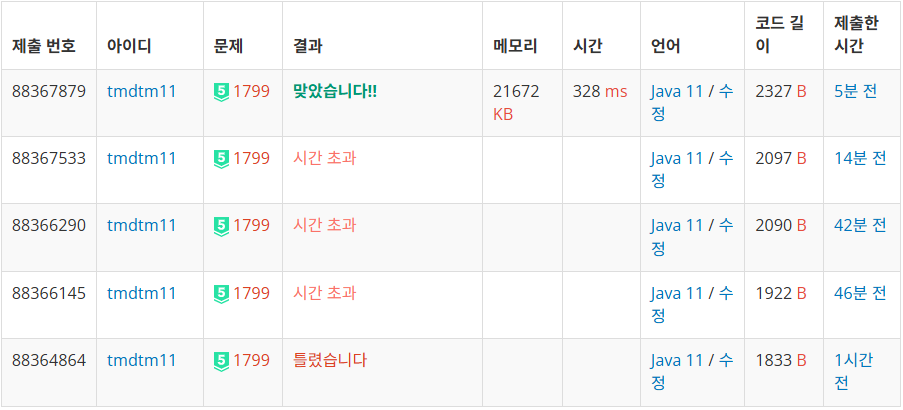

https://www.acmicpc.net/problem/1799



## 풀이 아이디어

1. 비숍은 대각선으로만 움직일 수 있다.
2. 대각선을 연장하여 긋되, 배열을 넘어가지 않게 우상단, 우하단으로만 연장했다.
3. 대각선의 최대 값은 2 * N - 1이므로 2 * N - 1 크기의 배열을 두개 만들어 상단, 하단을 체크했다.
4. ** 추가로, 대각선의 끝점을 미리 계산하여, 반복문을 없앴다.
5. ** 추가로, 흑과 백을 나눠서 계산하는 방법으로 시간 복잡도를 줄였다.

## 개선 1

``` java
    public static boolean check(int y, int x) {
		for (int i = 0; i < N; i++) {
			if (y + dy[0] * i == 0) { // 오른쪽 위의 끝
				topX = x + dx[0] * i;
				topY = y + dy[0] * i;
			}
			if (y + dx[1] * i == N - 1) { // 오른쪽 아래의 끝
				bottomX = x + dx[1] * i;
				bottomY = y + dx[1] * i;
			}
		}

		if (top[topX] == 1 || bottom[bottomX] == 1)
			return false;
		else
			return true;
	}

    // 먼저 반복문이던 For문을 수식 계산으로 변경

	public static boolean check(int y, int x) {	
		int distanceToTop = y; // 현재 위치에서 오른쪽 위까지
		topX = x + distanceToTop;

		// 아래쪽 끝점 계산
		int distanceToBottom = N - 1 - y; // 현재 위치에서 오른쪽 아래까지
		bottomX = x + distanceToBottom;

		if (topX >= 2 * N - 1 || bottomX >= 2 * N - 1 || top[topX] == 1 || bottom[bottomX] == 1) {
			return false;
		}
		return true;
	}
	
```

## 개선 2

``` java
		roop(0, 0, 0, 0); // 흑
		int blackMax = answer;
		answer = 0;
		roop(0, 0, 0, 1); // 백
		int whiteMax = answer;
```

그래도 시간초과를 해결하지 못했고, 백준 질문 게시판에서 흑백을 나눠 계산한다는 참신한 이야기를 듣고, 흑백을 간단하게 나누어 roop함수에 인자로 주어서 백트래킹했다.
